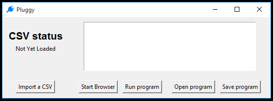
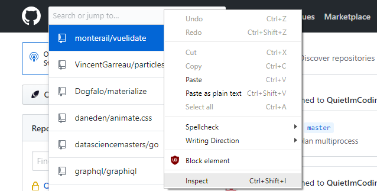
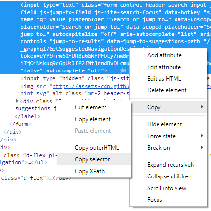

# Pluggy
Plug data from CSV file into a website

## Description
Pluggy is a Selenium-based application for plugging information into websites. 
It is effectively an interpreter for its own scripting language that lets it control a browser.
It then runs the script you give it while iterating over a CSV file you provide.
 
## Installing Pluggy

## General Usage Instructions
Once pluggy is opened, you should see a window that looks like this



The main parts of the window you'll see are:
* The CSV import button
    * You use this button to import a CSV and make all of its column data available to your script
* The open and save program buttons on the right
    * These are useful if you have the same steps you need to take and want to run them on different files.
    * Unless you have a good reason, it's probably best 
    to always save your pluggy scripts. 
* The start browser button. 
    * This opens the browser you're running your script in. 
    * You always have to do this before running anything which is useful, 
    especially if you need to sign into a website to use it in your script. 
* The scripting window
    * This is where you write + test pluggy scripts
* The run program button
    * This runs your script for each row of the CSV file you loaded. 

Generally, the process to run a script will be:
1. Import a csv
2. Write or load a pluggy script file (.bap extension)
3. Start a browser (log in to sites if neccessary)
4. Run script

## Finding website elements

In order to use the ```click``` command, you first need to ```set``` a string containing the location of the element on the website. 
The way Pluggy finds these is using the CSS selector. 

To find the CSS selector of an element in Google Chrome:


* Right click the element you want to get the selector for and click inspect. 


* Right click on the big highlighted part and click Copy > Copy selector
* The CSS selector you get in your clipboard is used to uniquely identify the element on the page. 


* This allows you to do things like:

    ```
    set wikipedia 'https://en.wikipedia.org/'
    set searchbar '#searchInput'
    set searchbtn '#searchButton'
    goto wikipedia
    click searchbar
    type name
    click searchbtn
    ```

* It's worth noting that longer selectors might be dynamically generated by the page, and therefore hard to predictably find. 

## Pluggy Script Syntax

The syntax of pluggy scripts revolves around the use of variables to store any string of text that isn't a command. 
That means that probably the most important command is the ```set``` command

The syntax of the ```set``` command is pretty simple. ```set <variable name> 'your string here'```.
One important thing to note here is that you need to use single quotes around your text. **Double quotes will not work!**

The next important command is the ```goto``` command. This command is used to take your browser to a certain website.

As an example, if you import the *animaldata.csv* file from the examples folder and just run ```goto url```, 
you'll see your browser going to the google URL for each animal in the file. 

Of course, the whole point of this project is interacting with the page so the language contains two functions to
deal with page interaction: ```click``` and ```type```. These act like you would expect when using a website. 
You always want to click the element before you use the type command. Both commands expect to be using a string variable
so even if you just want a short string you'll need to set the variable in advance.

Putting it all together, we can try to write a script that uses DuckDuckGo instead of Google

```
set duckduckgo 'https://duckduckgo.com/'
set searchbar '#search_form_input_homepage'
set searchbtn '#search_button_homepage'

goto duckduckgo
click searchbar
type name
click searchbtn
```

Knowing the four basic commands, there are only two more commands that are available. These are the ```cut ``` and ```paste``` commands. 

The ```cut``` command is still under construction, but the ```paste``` command can be used as
 ```paste <new variable name> <old variable 1> <old variable 2>```
 
 An example can be used to replace the url field in the animal data. Instead of having to store the URL, you can instead use
 
 ```
 set googlesearch 'https://www.google.com/search?q='
 paste searchurl googlesearch name
 goto searchurl
 ```
 