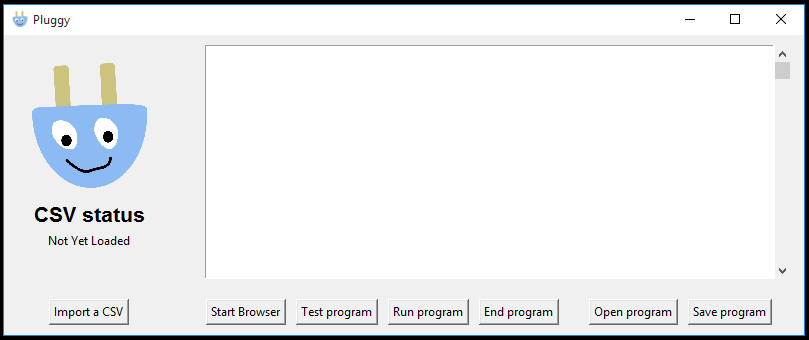

# Pluggy
Plug data from CSV file into a website

## Description
Pluggy is a Selenium-based application for plugging information into websites. 
It is effectively an interpreter for its own scripting language that lets it control a browser.
It then runs the script you give it while iterating over a CSV file you provide.
 
## Installing Pluggy

If you have python installed or want to modify source code, you can pull this repository and just run pluggy.py. 
If you just want to use pluggy as-is, you can extract the Pluggy.zip file to a folder and run the pluggy.exe file in the resulting folder.

## General Usage Instructions
Once pluggy is opened, you should see a window that looks like this


[](https://app.fossa.io/projects/git%2Bgithub.com%2FQuietImCoding%2FPluggy?ref=badge_shield)

The main parts of the window you'll see are:
* The CSV import button
    * You use this button to import a CSV and make all of its column data available to your script
* The open and save program buttons on the right
    * These are useful if you have the same steps you need to take and want to run them on different files.
    * Unless you have a good reason, it's probably best 
    to always save your pluggy scripts. 
* The start browser button. 
    * This opens the browser you're running your script in. 
    * You always have to do this before running anything which is useful, 
    especially if you need to sign into a website to use it in your script. 
* The scripting window
    * This is where you write + test pluggy scripts
* The test program button
    * This only runs your script on the first row of data and is invaluable for testing if you're running a lot of steps. 
* The run program button
    * This runs your script for each row of the CSV file you loaded. 

Generally, the process to run a script will be:
1. Import a csv
2. Write or load a pluggy script file (.plgy extension)
3. Start a browser (log in to sites if neccessary)
4. Test script on one element
5. Run script

## Finding website elements

In order to use the `click` command, you first need to `set` a string containing the location of the element on the website. 
The way Pluggy finds these is using the CSS selector. 

To find the CSS selector of an element in Google Chrome:


* Right click the element you want to get the selector for and click inspect. 


* Right click on the big highlighted part and click Copy > Copy selector
* The CSS selector you get in your clipboard is used to uniquely identify the element on the page. 


* This allows you to do things like:

    ```
    set wikipedia 'https://en.wikipedia.org/'
    set searchbar '#searchInput'
    set searchbtn '#searchButton'
    goto wikipedia
    click searchbar
    type name
    click searchbtn
    ```

* It's worth noting that longer selectors might be dynamically generated by the page, and therefore hard to predictably find. 

## Pluggy Script Syntax

The syntax of pluggy scripts revolves around the use of variables to store any string of text that isn't a command. 
That means that probably the most important command is the `set` command

The syntax of the `set` command is pretty simple. `set <var name> 'your string here'`.
One important thing to note here is that you need to use single quotes around your text. **Double quotes will not work!**

Besides the `set` command, there are four other basic commands you can use for interacting with the page. These are listed below.

* `goto <website>` This command takes one argument and takes your browser to *website*.
* `click <selector>` This command takes one argument and is used to click the element described by the CSS selector in *selector*.
* `type <string>` This command takes one argument and types *string* into the last element clicked.
* `put <string>` This command takes one argument and replaces whatever was in the last elment clicked with *string*.
It is particularly useful with large blocks of text because it is much faster and preserves escape sequences such as `\n`

With these five commands, we can try to write a script that uses DuckDuckGo instead of Google:

```
set duckduckgo 'https://duckduckgo.com/'
set searchbar '#search_form_input_homepage'
set searchbtn '#search_button_homepage'

goto duckduckgo
click searchbar
type name
click searchbtn
```

Knowing the five basic commands will allow you to automate a large number of tasks if you pre-process your data somewhat.
However, there are a few more advanced commands that you can use to have Pluggy do even more hard work for you:

* ```cut <var name> <original var> <optional start> <end>``` This saves whatever was in *original var* between *start* and *end* into *var name*.
If only one number is provided, this command will get everything from the start of the string to that index. Use END to indicate the end of the string.
* ```paste <var name> <var1> <var2>``` This appends *var2* to the end of *var1* and stores the result in *var name*
* ```get <var name> <selector>``` This will store the text from the element identified by *selector* into *var name*
* ```clear``` Clears the last input box clicked
* ```enter``` Simulates pressing the "enter" key on your keyboard. 
Useful for selecting elements from dropdowns or submitting forms without finding the button.

Finally, the `log` command in pluggy allows you to keep a log of what happened while your script ran, so that you can look over it later. 
This command is generally used with the results of a `get` command and uses the syntax `log <var name>`. 
The combination of these two commands allows you to find and store the text within an element, or to check if an element ever appeared.
After your script finishes running, a window will pop up asking you where you want to store the logged results.

To tie this all together, heare's one more example program, still using the animals CSV file in the examples folder:

 ```
 set url 'https://duckduckgo.com/'
set searchbox_sel '#search_form_input_homepage'
set firstres_sel '#r1-0 > div > h2 > a.result__a'
set space ' '

cut shortheight height 4
paste oddquery name space
paste oddquery oddquery shortheight

goto url
click searchbox_sel
put oddquery
enter

get res1 firstres_sel
log res1

click firstres_sel
```

As you can hopefully tell, this script goes to duckduckgo, 
searches for the name of the animal followed by the height of the animal rounded to 4 digits, 
and then logs and clicks the first result.

Good luck using Pluggy! If you have any questions, you can email me at the email address on my profile or raise an issue on Github. 

## License
[](https://app.fossa.io/projects/git%2Bgithub.com%2FQuietImCoding%2FPluggy?ref=badge_large)